# Flask_codechef

## Flask based Codechef Scraping website

### this website helps to fetch all Problem statment of any past contest and subbmit solution of any specific user.

## screenshot

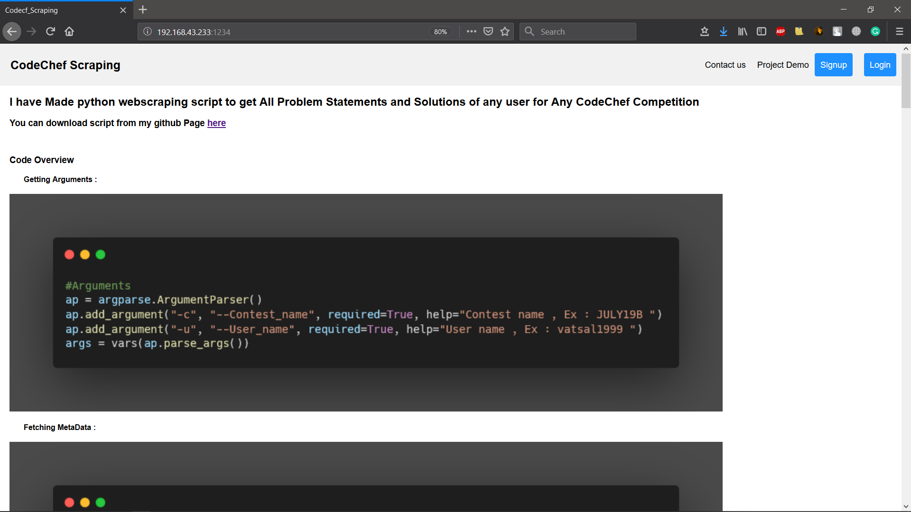
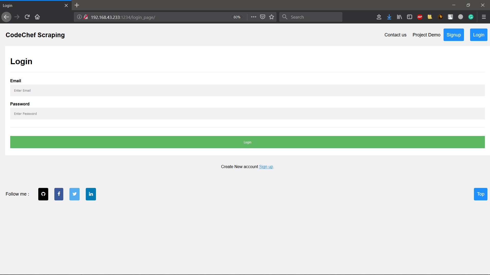
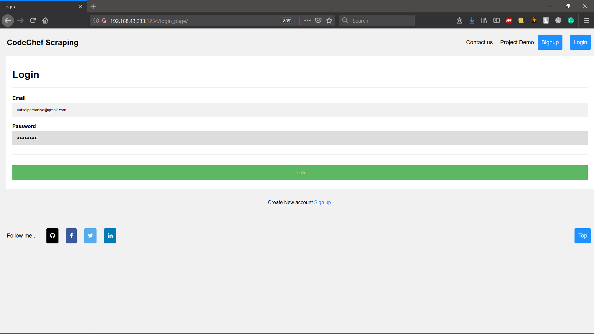
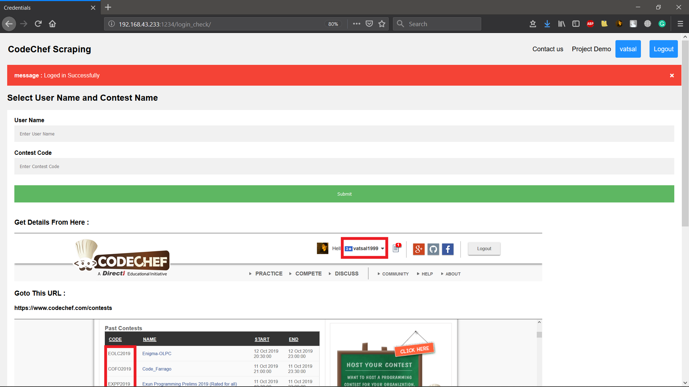
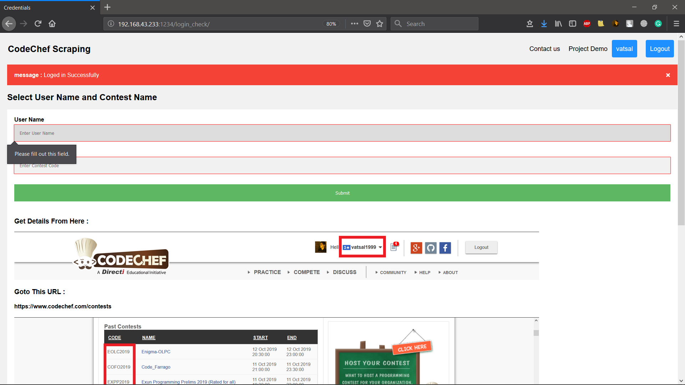
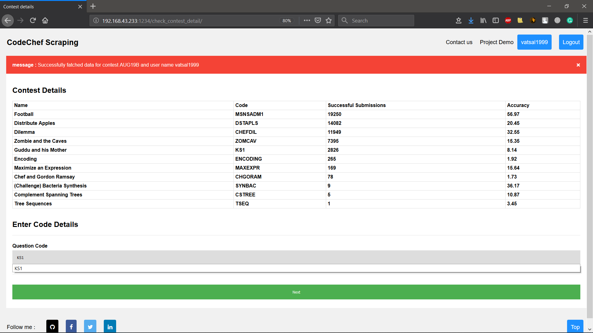
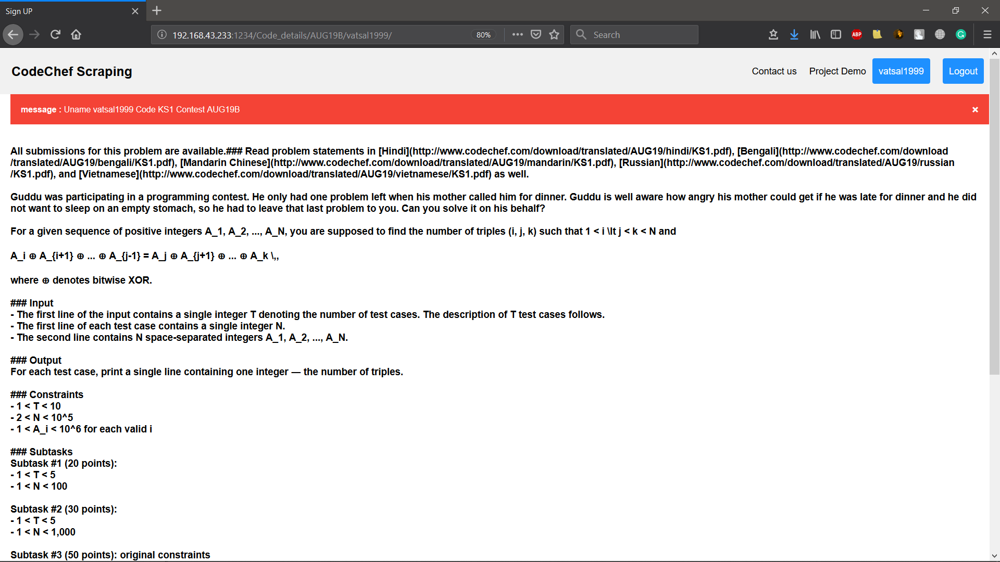
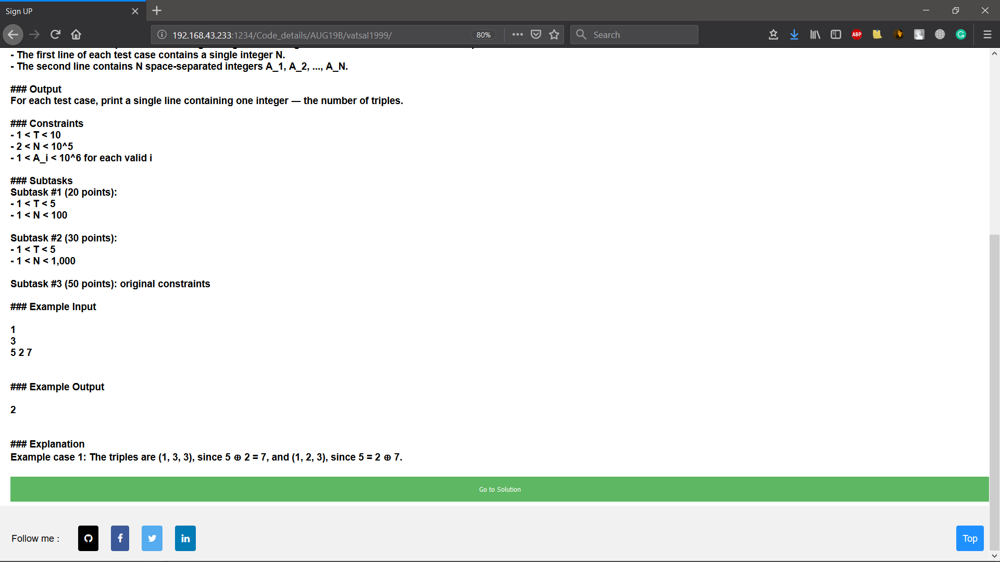
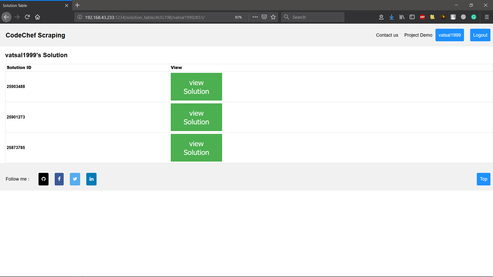
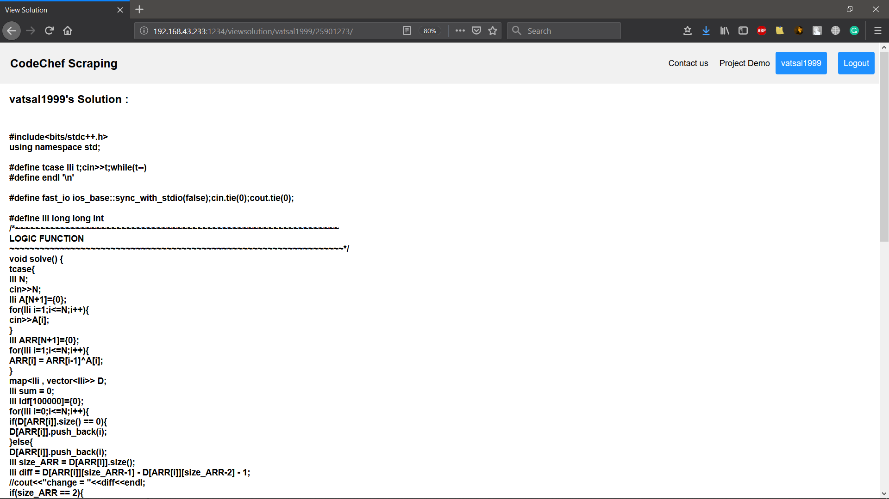
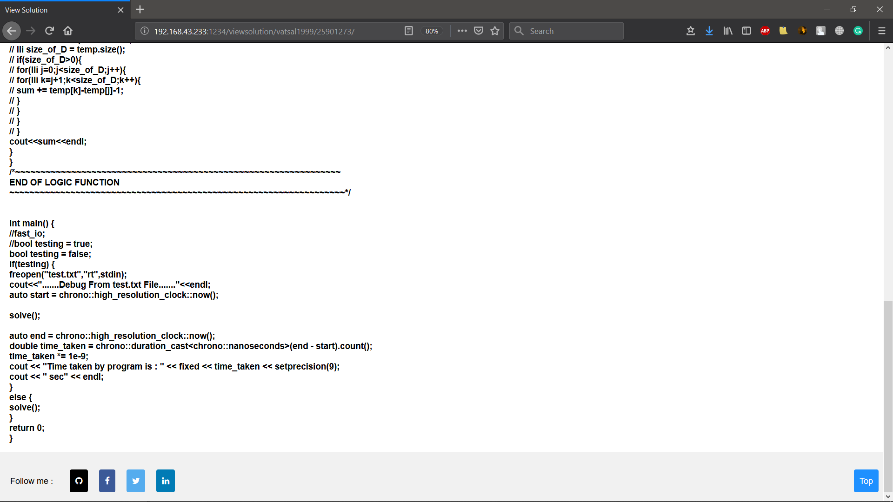
